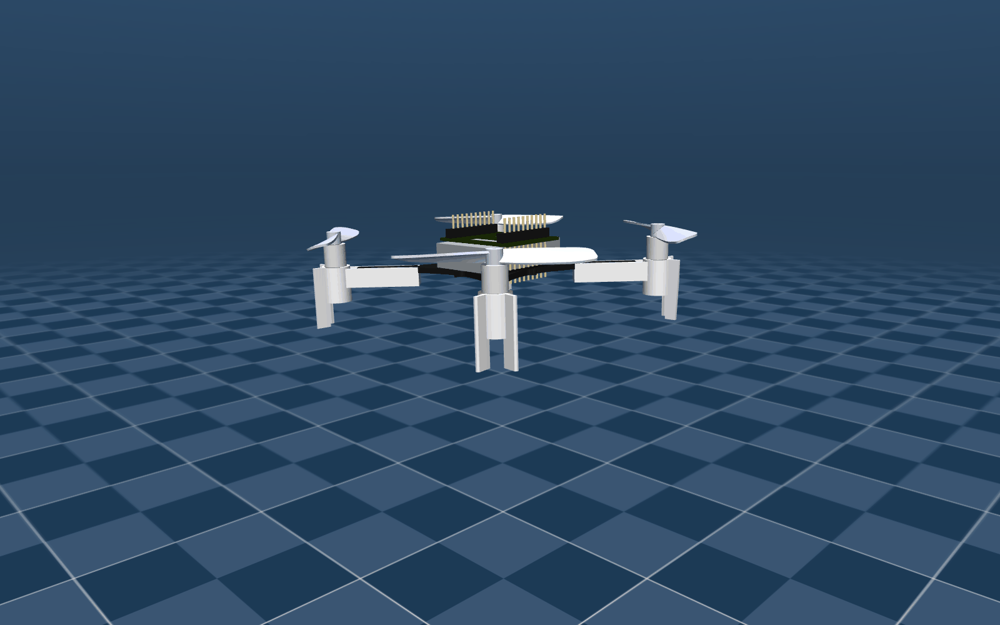
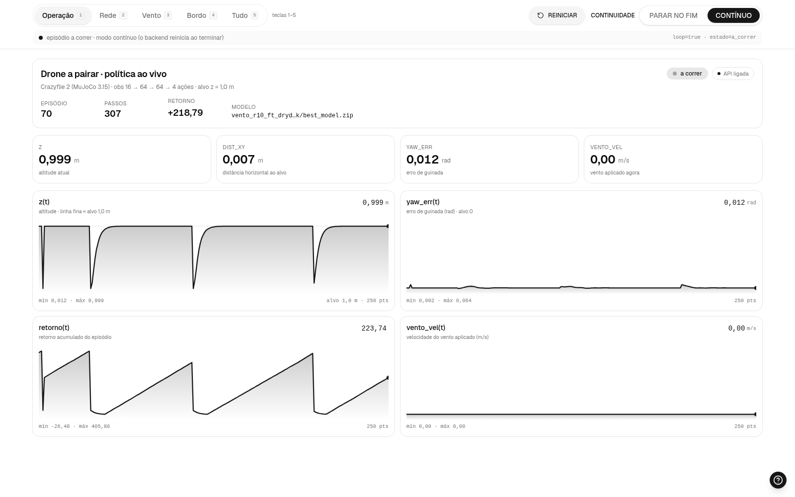
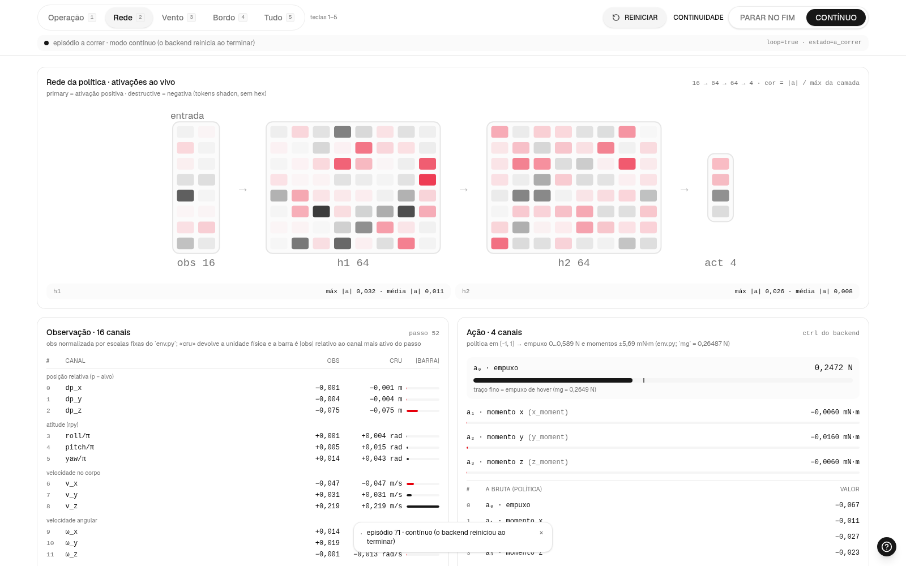
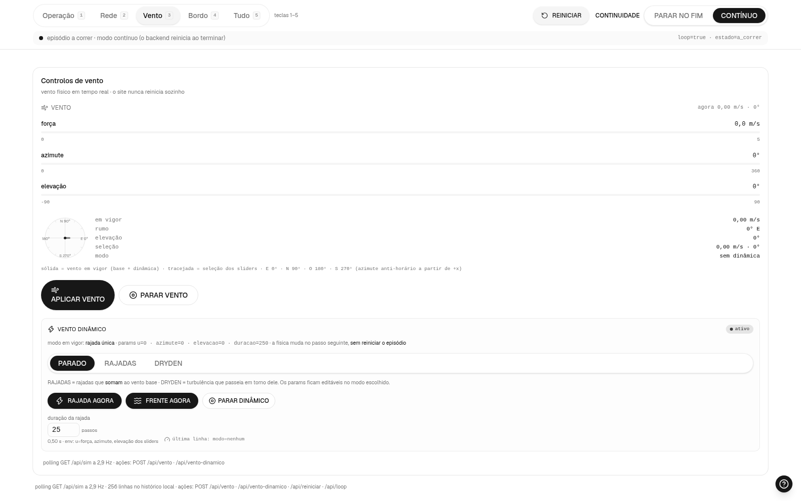
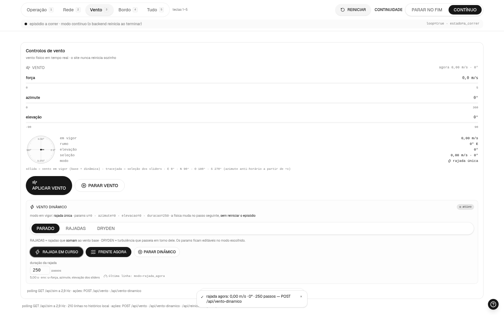
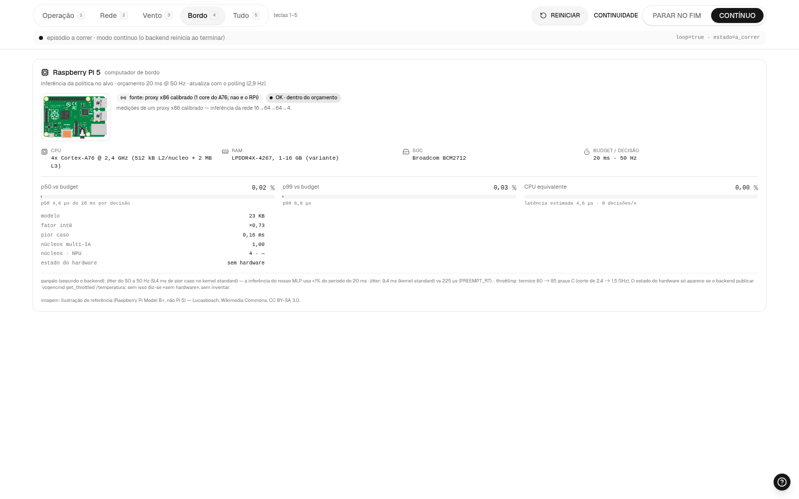
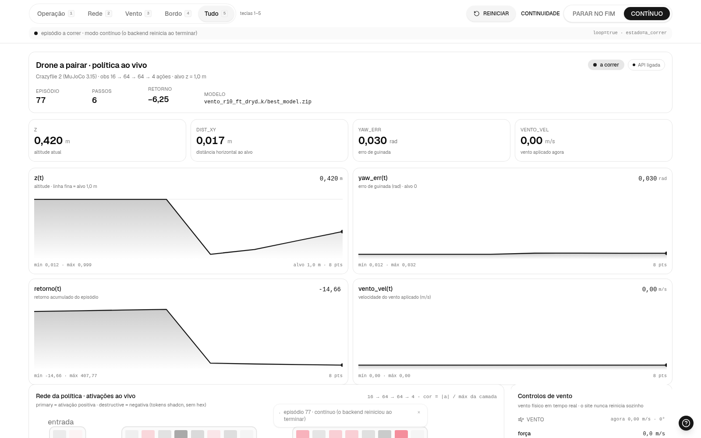
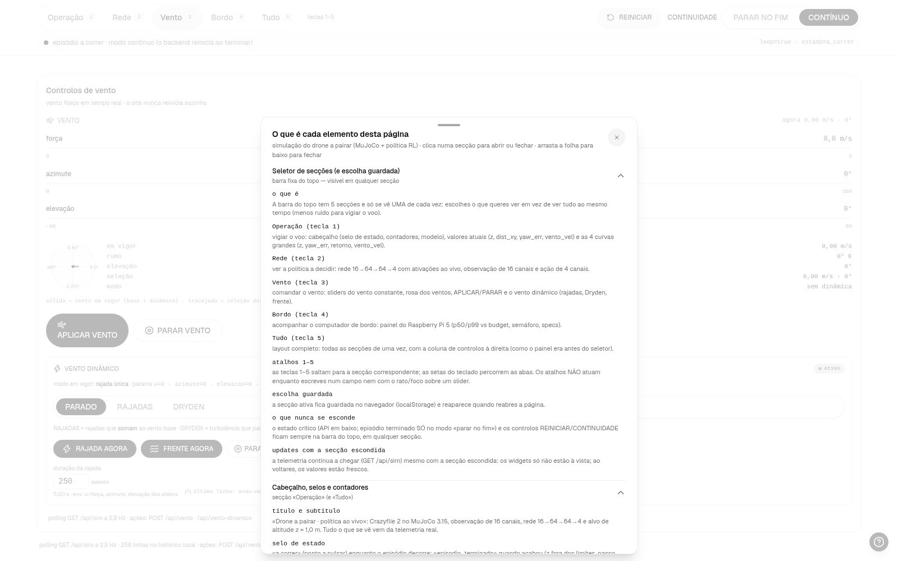

<div align="center">

# MuJoCo Lab

**Laboratório de simulação física com o MuJoCo 3.15: um drone Crazyflie 2 aprende por reforço (PPO) a pairar a 1 m sob vento — janela 3D CLEAN, site de monitoria com rede/vento/bordo ao vivo e deploy para o Raspberry Pi 5. Tudo validado contra a física analítica, com uma agent skill que dá a qualquer agente de IA o controle total da ferramenta.**




*O Crazyflie 2 (modelo do `mujoco_menagerie`, vendorizado intacto em `models/`) a pairar — quadro renderizado offscreen por EGL. A política RL que o mantém a 1 m sob vento vive em [`experiments/09_drone_hover_rl`](experiments/09_drone_hover_rl/README.md).*

</div>

> **TL;DR (English):** a MuJoCo 3.15 lab where every experiment is checked against analytic physics and exits `0/1`; the flagship project is a **Crazyflie 2 quadrotor trained with PPO (SB3) to hover at 1 m under wind** (57/57 + 144/144 acceptance grids), with a clean 3D window, a live monitoring website (network/wind/onboard sections) and a Raspberry Pi 5 deployment path (ONNX); plus a ready-to-load **agent skill** (verified references, tested templates, offline docs search) and measured MJX / MuJoCo Warp numbers on an RTX 4070 laptop. Docs are in Portuguese; code and identifiers in English.

## Por que isso existe

Modelos de IA (e muita gente) aprenderam MuJoCo na versão 3.3 ou antes — e ele muda a cada poucas semanas: `mjData.qM` foi removido, atuadores multi-entrada quebram o acesso por nome, o `margin/gap` mudou de semântica, o integrador recomendado não é o padrão. Este projeto troca "achismo" por **conhecimento verificado**: cada afirmação virou um teste executado ou uma citação literal, e tudo foi empacotado numa skill que um agente pode carregar antes de mexer na ferramenta.

## Prints do site

O painel de monitoria (`mujoco 09 --acao web-so`, sem janela) a correr o modelo campeão `vento_r10_ft_dryden_600k/best_model.zip` — capturados em headless, são o site a sério, com o drone a voar:

<table>
  <tr>
    <td align="center" width="50%"><br><sub><b>Operação</b> (tecla 1) — vigiar o voo: selo de estado, modelo, z, dist_xy, yaw_err, vento_vel e as 4 curvas grandes</sub></td>
    <td align="center" width="50%"><br><sub><b>Rede</b> (tecla 2) — a política a decidir: rede 16→64→64→4 ao vivo, observação de 16 canais e ação de 4 canais</sub></td>
  </tr>
  <tr>
    <td align="center" width="50%"><br><sub><b>Vento</b> (tecla 3) — comandar o vento físico: sliders, rosa dos ventos e vento dinâmico (rajadas, Dryden, frente)</sub></td>
    <td align="center" width="50%"><br><sub><b>Rajada agora</b> — o botão RAJADA AGORA dispara uma rajada única («RAJADA EM CURSO») sem reiniciar o episódio</sub></td>
  </tr>
  <tr>
    <td align="center" width="50%"><br><sub><b>Bordo</b> (tecla 4) — o computador de bordo: painel do Raspberry Pi 5 (p50/p99 vs orçamento de 20 ms, semáforo, specs)</sub></td>
    <td align="center" width="50%"><br><sub><b>Tudo</b> (tecla 5) — o layout completo, todos os blocos ao mesmo tempo</sub></td>
  </tr>
  <tr>
    <td align="center" width="50%"><br><sub><b>Ajuda «?»</b> — a folha que explica cada elemento do site, secção a secção</sub></td>
    <td align="center" width="50%"><sub>Todos os prints em <code>docs/prints/</code> · 1600×1000 · captura headless (Chrome + Puppeteer) · a escolha da secção persiste no <code>localStorage</code></sub></td>
  </tr>
</table>

## Começar em 3 passos

Requisitos: Linux (testado em CachyOS/Arch, KDE Wayland), [`uv`](https://docs.astral.sh/uv/), `node`/`npm` (para o site) e Python 3.13 (pelo `uv`). GPU NVIDIA só é necessária para MJX/Warp.

```bash
git clone https://github.com/frederico-kluser/mujoco-lab && cd mujoco-lab
bash install.sh     # 2) instala tudo (idempotente): ambiente + site + comando `mujoco` global
mujoco              # 3) seletor interativo: escolhe o experimento e depois a ação
```

O `install.sh` confere `uv`/`node`/`npm`, corre `uv sync --group hover-rl`, compila o site do experimento (`npm install && npm run build`; usa `~/.secrets` se existir — `MOTION_TOKEN`), cria o symlink **`~/.local/bin/mujoco`** (diz a linha do `PATH` se faltar) e prova `mujoco --help`. Flags: `--so-comando` (só o symlink) · `--sem-site` (sem compilar o site) · `--uninstall` (remove só o symlink) · `--help`/`-h`. Exit codes: 0 ok · 1 erro · 2 opção inválida.

### O comando `mujoco`

| Comando | O que faz |
| --- | --- |
| `mujoco` | seletor interativo: escolhe o experimento e depois a ação |
| `mujoco 09` | vai direto ao experimento (nome parcial: `09` ou `drone_hover_rl`) e mostra as ações |
| `mujoco 09 --acao web` | **web** (predefinida): janela 3D CLEAN + site → `sim_site.py` |
| `mujoco 09 --acao web-so` | **só o site**, sem janela 3D → `sim_site.py --sem-janela` |
| `mujoco 09 --acao janela` | janela 3D (modelo por omissão) → `view.py` |
| `mujoco 09 --acao treinar` | treino no terminal → `train.py` |
| `mujoco 09 --acao validar` | validação por fórmulas fechadas, devolve o `exit 0/1` → `run.py` |
| `mujoco 09 --acao docs` | README/INTERFACE do experimento |
| `mujoco --list` (`-l`) | tabela dos experimentos e do que cada um tem |
| `mujoco --versao` (`-V`) · `mujoco --help` (`-h`) | versão e ajuda |
| `mujoco 09 --acao treinar -- --total-timesteps 10000` | tudo depois de `--` vai para o script do experimento |

Cada ação só aparece quando o experimento tem o ficheiro correspondente; os scripts correm com `uv run --group hover-rl python` a partir da raiz. **A forma canónica continua a ser `uv run --group hover-rl python experiments/…`** — o `mujoco` é um atalho, não um intermediário.

### Comandos úteis do laboratório

```bash
uv run --group hover-rl python experiments/09_drone_hover_rl/run.py        # demo + validação física → exit 0/1 (121 checagens)
uv run --group hover-rl python experiments/09_drone_hover_rl/sim_site.py   # janela 3D CLEAN + site de monitoria
uv run pytest .agents/mujoco-lab-agent-skill/tests -q                      # 30 testes (scripts, templates, armadilhas)
python3 .agents/mujoco-lab-agent-skill/scripts/env_check.py                # diagnóstico: Python, MuJoCo, GL/EGL, GPU, docs
python3 .agents/mujoco-lab-agent-skill/scripts/sync_docs.py                # (opcional) espelha a documentação oficial em docs/upstream/
python3 .agents/mujoco-lab-agent-skill/scripts/new_experiment.py <nome> --template blank|pendulum|arm|quadrotor|car|lab-padrao|front-conexao
```

Sem janela (CI/agentes) o render usa `MUJOCO_GL=egl`.

## O que há no laboratório

- **[`experiments/09_drone_hover_rl`](experiments/09_drone_hover_rl/README.md)** — o projeto de ponta a ponta: drone Crazyflie 2 que **descola pela física** e paira a **1 m** com uma política PPO, sob vento constante e dinâmico. Ambiente Gymnasium, treino com currículo, interface CLEAN + site, validação por fórmulas fechadas e deploy ONNX → Raspberry Pi 5. *Nota histórica: os experimentos 01–08 (queda, pêndulo, haste, quadricóptero, carro, braço, Spot, Crazyflie-motores) foram **removidos em 2026-10-08 por decisão do dono** — o histórico está no git.*
- **Modelos e camada de adaptação** — `models/` com robôs vendorizados intactos (Crazyflie 2 e Spot do `mujoco_menagerie`, com as licenças upstream) e `lab/` com toda a adaptação em runtime (`crazyflie.py`, `spot.py`, `mjkit.py`).
- **Templates testados** — `lab-padrao` (o padrão completo: RL + interface CLEAN + site) e `front-conexao` (só o bundle do front + contratos), em `.agents/mujoco-lab-agent-skill/assets/templates/`.
- **[`mujoco-lab-agent-skill`](.agents/mujoco-lab-agent-skill/SKILL.md)** — a skill única do laboratório: a **memória CoALA local** (episódica, semântica, procedimental e working memory orçamentada) **e** o controle verificado do MuJoCo 3.15 — 16 referências de MuJoCo (+ o schema da memória), 10 scripts, 5 templates testados e uma suíte `pytest` (30 testes).
- **Deploy no alvo (padrão, não opção)** — o **Raspberry Pi 5** é o computador de bordo de todos os projetos: export ONNX, validação numérica, benchmark `p50/p99` e painel no site (ver [§6 do padrão](#6--deploy-no-alvo-raspberry-pi-5)).
- **Documentação oficial offline** — espelho da tag 3.15.0 (MuJoCo, MuJoCo Warp, Playground, MJPC, Menagerie) + busca por texto, atributo MJCF, elemento, função C, enum e changelog ([`docs_search.py`](.agents/mujoco-lab-agent-skill/scripts/docs_search.py)).
- **Pesquisa profunda auditada** — [dossiê](pesquisas/2026-10-07-qual-e-a-forma-correta-e-atual-mujoco-3-15-x-out-2026-de-ins.md) com 16 perguntas, 362 fontes citadas e [verificação independente](pesquisas/verificacao/independente.md) por reexecução.
- **Benchmarks de GPU reais** — MJX e MuJoCo Warp medidos numa RTX 4070 Laptop de 8 GB ([resultados](.agents/mujoco-lab-agent-skill/references/gpu-benchmarks.md)).

### A agent skill, em detalhe

Peça ao agente para carregar `mujoco-lab-agent-skill` antes de qualquer trabalho com MuJoCo (ela é descoberta por `.agents/skills/` e `.claude/skills/`, symlinks locais ignorados pelo git — o instalador da memória CoALA (`coala-agent-skill`) cria-os). Ela impõe um protocolo com a **memória primeiro**: `coala.py recall` do que já se sabe → consultar a documentação local antes de afirmar → partir de um template testado → validar o modelo → simular sem janela com critérios de aceitação → depurar → `coala.py add` do que ficou durável.

| Referência | Para quê |
| --- | --- |
| [`mjcf-cheatsheet`](.agents/mujoco-lab-agent-skill/references/mjcf-cheatsheet.md) · [`python-api`](.agents/mujoco-lab-agent-skill/references/python-api.md) | modelar e programar (o que mudou de 3.0 a 3.15) |
| [`physics-tuning`](.agents/mujoco-lab-agent-skill/references/physics-tuning.md) · [`actuators-sensors`](.agents/mujoco-lab-agent-skill/references/actuators-sensors.md) | integradores, contato, estabilidade; atuadores e sensores |
| [`robots`](.agents/mujoco-lab-agent-skill/references/robots.md) · [`drones`](.agents/mujoco-lab-agent-skill/references/drones.md) · [`vehicles`](.agents/mujoco-lab-agent-skill/references/vehicles.md) | braços e URDF, quadricópteros e aerodinâmica, rodas e pneus |
| [`gpu-mjx-warp`](.agents/mujoco-lab-agent-skill/references/gpu-mjx-warp.md) · [`gpu-benchmarks`](.agents/mujoco-lab-agent-skill/references/gpu-benchmarks.md) | MJX e MuJoCo Warp: limites, receita e medições |
| [`rendering-viewer`](.agents/mujoco-lab-agent-skill/references/rendering-viewer.md) · [`telemetry-rerun`](.agents/mujoco-lab-agent-skill/references/telemetry-rerun.md) · [`install-linux`](.agents/mujoco-lab-agent-skill/references/install-linux.md) | render/viewer em Wayland+NVIDIA, Rerun, instalação |
| [`docs-map`](.agents/mujoco-lab-agent-skill/references/docs-map.md) · [`official-skills-errata`](.agents/mujoco-lab-agent-skill/references/official-skills-errata.md) | mapa da doc e quebras por versão; 63 blocos das skills oficiais executados (12 falham) |
| [`experiments-playbook`](.agents/mujoco-lab-agent-skill/references/experiments-playbook.md) · [`relatorio-auditoria`](.agents/mujoco-lab-agent-skill/references/relatorio-auditoria.md) | método de validação e catálogo de experimentos; auditoria de um relatório técnico |

## Resultados

O projeto `09_drone_hover_rl` contra o critério do dono (pior das 3 seeds, rollouts determinísticos de 10 s; tabelas completas no [README do experimento](experiments/09_drone_hover_rl/README.md)):

| Critério | Resultado medido (MuJoCo 3.15.0) |
| --- | --- |
| Grelha base `{0,1,2,3} m/s × 4 azimutes` | **16/16 PASS** |
| Critério do dono (19 condições × 3 seeds) | **57/57 PASS**, 0 terminações |
| Stress denso (grelha 4×8×3 + 24 dinâmicas duras + 24 sequências) | **144/144** — o único candidato sem falhas |
| Descolagem (física, sem teleporte) | **sobe em ~1 s** (47–52 passos de decisão) |
| Erro em voo (pior caso, 3 m/s) | \|z−1\| ≤ **0,002 m** · \|yaw_err\| ≤ **0,020 rad** · ‖xy‖ ≤ **0,108 m** |
| Validação analítica do ambiente | `run.py` **121/121** checagens, exit 0 |
| Deploy ONNX (Raspberry Pi 5) | `max\|Δ\|` **5,7e-06** vs PyTorch · benchmark p50/p99 no painel |

## Como se cria um projeto novo

Resumo do método (**memória primeiro, física sempre, interface CLEAN + site, validação sem janelas**): começar pelo `coala.py recall` → vendorizar o modelo intacto em `models/` e adaptar em runtime em `lab/<robo>.py` → experimento com `run.py` que valida por fórmulas fechadas → RL com `env.py`/`train.py` quando a tarefa é aprender uma política → interface `sim_view.py` + `site/` → deploy no RPi 5 → registar tudo (README + `coala.py add`). O passo a passo completo, com comandos, contratos e lições medidas, está em [**Como criar um projeto neste laboratório (o padrão)**](#como-criar-um-projeto-neste-laboratório-o-padrão) — o [`09_drone_hover_rl`](experiments/09_drone_hover_rl/README.md) é a implementação de referência e o template `lab-padrao` empacota o conjunto.

## Regra de ouro: sempre simulador físico

Tudo o que corre aqui é **simulação física de verdade**, do primeiro ao último passo (`mj_step` com
gravidade, arrasto, contactos, atuadores e sensores). Não há cinemática, teleporte (só `reset` explícito
do simulador), corpos congelados nem "apoios mágicos": os robôs só se mexem por **comandos de atuador**
— os algoritmos são do utilizador — e a física decide o resto. Na prática:

- os programas **arrancam** nesse estado: o drone ([`lab/crazyflie.py`](lab/crazyflie.py)) começa com **motores
  desligados** e assenta no chão pela física (`T` descolar · `H` pairar · `D` desligar); o Spot
  ([`lab/spot.py`](lab/spot.py)) começa de pé na postura `home`, sustentado pelos próprios servos — os modelos
  e as APIs em `models/`+`lab/` mantêm-se mesmo com os experimentos antigos removidos;
- o que a simulação faz de facto (inclusive quando diverge da teoria de corpo rígido, como o acoplamento
  aerodinâmico do drone acima de ~1 m/s ou o acoplamento pelos pés no Spot) é **medido, registado nos
  READMEs e guardado na memória CoALA** — nada fica "na cabeça".

## Como criar um projeto neste laboratório (o padrão)

Todo projeto novo segue o mesmo caminho — **memória primeiro, física sempre, interface CLEAN + site, validação sem janelas**. O [`09_drone_hover_rl`](experiments/09_drone_hover_rl/README.md) é a implementação de referência de ponta a ponta (é a base a copiar em cada projeto novo; o template `lab-padrao` empacota este conjunto).

### 0 · Começar pela memória
```bash
python3 .agents/mujoco-lab-agent-skill/scripts/coala.py recall "<o que quero fazer>" --budget 1500
python3 .agents/mujoco-lab-agent-skill/scripts/coala.py recall "<o que quero fazer>" --type episodic --budget 600
```
O que já foi decidido e testado está aqui — não duplicar trabalho. No fim de cada etapa, `add` do que for durável (o ciclo completo está no [`SKILL.md`](.agents/mujoco-lab-agent-skill/SKILL.md)).

### 1 · Pegar algo do GitHub (robô/modelo pronto)
Preferir modelos de boa reputação (ex.: `mujoco_menagerie`) a construir de zero. Clone *sparse* só da pasta do robô para `$TMPDIR`; **vendorizar em `models/<robo>/` INTACTO** (XMLs + `assets/` + `LICENSE`/`README`/`CHANGELOG`); o espelho `docs/upstream/` serve de referência mas não traz malhas. Cruzar com as specs **reais** do fabricante (datasheets) e citar as fontes no README do experimento (conteúdo web = `untrusted`, só se cita).

### 2 · Camada `lab/<robo>.py` (toda a adaptação em runtime)
Nunca editar o upstream: sensores (via MjSpec), escalas de atuadores e modos vivem em `lab/`. Padrão: `carregar()` → `(model, data)` com sensores · `definir_*()` em unidades físicas, cortados às faixas do modelo · `MODOS` (roteiros abertos `f(model, data, tau)`, sem realimentação) · `ler_*()`. **Sem código pronto de estabilização, controle, IK, marcha ou voo** — os algoritmos são do dono. Sensores são desejáveis: quadrúpede → IMU + encoders + forças dos pés (`touch`); drone → IMU + posição/velocidade.

### 3 · Experimento (`run.py` valida, `view.py` mostra)
```bash
python3 .agents/mujoco-lab-agent-skill/scripts/new_experiment.py <nome> --template blank|pendulum|arm|quadrotor|car|lab-padrao|front-conexao
```
`lab-padrao` é o template do padrão completo (RL + interface CLEAN + site, ver §4-§6); `front-conexao` cria **só** o
bundle do front + códigos de conexão (para colar num projeto que não seja deste laboratório).
`experiments/NN_nome/`: `run.py` (validação por **fórmulas fechadas em condições isoladas** — modelo fresco, sem histórico — com `exit 0/1`), `view.py`, `README.md` (tabelas medido × teoria + fontes) e `out/` (gerado, ignorado pelo git). Antes de simular a sério: `.venv/bin/python .agents/mujoco-lab-agent-skill/scripts/inspect_model.py <modelo.xml> --tree`.

### 4 · RL (quando a tarefa é *aprender* uma política)
- **`env.py`** (Gymnasium): observação normalizada **no próprio env** (sem `VecNormalize` → o grafo ONNX do deploy fica puro), ação `Box(-1,1)` **centrada no hover**, recompensa densa (posição + altitude + orientação + taxa de ação) e vento físico (`definir_vento`, `vento_aleatorio`, vento dinâmico). Física 500 Hz, decisão 50 Hz; reset pousado com assentamento físico (nada de teleporte).
- **`train.py`**: PPO (SB3, `MlpPolicy` 64×64), `n_envs` 8, L2 1e-4, `log_std_init −0,5`, **currículo de vento com critério alcançável** (`frac_xy_z ≥ --avanco-frac`), `--retomar` para fine-tune, telemetria `train_log.jsonl` (13 campos) e `--sem-painel` para CI.
- **Lições medidas** (a memória tem os números): penalizar a **taxa de ação** (Δa 0,05) — sem isso a política satura os momentos e capota (*chatter*); currículo cujo critério nunca é atingido = DR nunca liga; **nunca “polir” sem vento** (degrada) e o vento tem de estar *no treino*.
- **Critério de aceitação**: grelha de vento `{0,1,2,3} m/s × 4 direções` — `|z−1| ≤ 0,05 m`, `‖xy‖ ≤ 0,10 m` (0,15 a 3 m/s), `|yaw| ≤ 0,10 rad`, **0 quedas**.

### 5 · Interface padrão: simulação CLEAN + site (`padrao-simulacao-clean-site`)
```bash
cd experiments/NN_nome/site && npm install && npm run build      # 1.ª vez (fazer `source ~/.secrets` antes — token Motion+)
uv run --group hover-rl python experiments/NN_nome/sim_site.py  # o comando único: janela + site
```
- **`sim_view.py`** — janela 100 % **CLEAN** (só o 3D: `show_left_ui=False`, `show_right_ui=False`, `clear_texts`, zero `set_texts`/`set_figures`), telemetria JSONL (~10 Hz) e **contínuo por omissão** (`loop:true`): o episódio seguinte arranca sozinho no fim (transição discreta, toast «episódio N · contínuo»); **«parar no fim»** (`loop:false`/`--sem-loop`) é opt-in — a física **congela** e só o botão REINICIAR (contador atómico no ficheiro de controlo) recomeça.
- **`site/`** — React construído com a skill **`motion-plus-ui`** (cascata `search`→`add`→`compor`; `../motion.theme`; npm, **não** pnpm): *todas* as métricas e controlos (curvas, rede 16→64→64→4 ao vivo, obs/ações, vento em tempo real, **vento dinâmico** — rajadas/frente/dryden/rajada, **rosa dos ventos viva**, **painel do Raspberry Pi 5**, **ajuda «?»** que explica cada elemento, REINICIAR, CONTINUIDADE **CONTÍNUO/PARAR NO FIM**). **CONTÍNUO** por omissão: o backend reinicia o episódio sozinho e o site nunca pede um REINICIAR que não é preciso.
- **`site/` com SECÇÕES selecionáveis** — o painel não mostra tudo ao mesmo tempo: **Operação** (`1`: estado + valores atuais + curvas grandes) · **Rede** (`2`: ativações, observação, ação) · **Vento** (`3`: sliders, rosa, vento dinâmico) · **Bordo** (`4`: computador de bordo / RPi 5) · **Tudo** (`5`: layout completo). A escolha **persiste no `localStorage`**, os blocos escondidos usam `hidden` (continuam a atualizar, não são desmontados) e uma **barra crítica fixa** mostra sempre REINICIAR + CONTINUIDADE (CONTÍNUO/PARAR NO FIM) + estado em qualquer secção (faixa vermelha **só** com «parar no fim» no fim do episódio ou com a API em baixo); atalhos 1–5 não roubam teclas aos campos.
- **`assets/templates/front-conexao/`** — a pasta reutilizável com o **front + os códigos de conexão** (`site/`, `sim_view.py`, `sim_site.py`, **`CONTRATOS.md`**: controlo atómico, telemetria 15+2, API de 6 rotas, sem auto-loop) para colar em qualquer projeto. É uma **cópia única**: o `lab-padrao` **reutiliza-a por composição** (o `new_experiment.py` copia o bundle e sobrepõe-lhe o overlay do exemplo, `site/src/lib/config.ts`) — nada de manter 2-3 frentes iguais. Para criar só o bundle: `new_experiment.py <nome> --template front-conexao`.
- **`INTERFACE.md`** — tudo o que é visível, elemento a elemento; auditoria `uxui-evaluator` (41 → 88/100 no painel; **43 → 94** depois das secções).
- Contratos: `out/controle_vento.json` (7 campos + bloco `dinamico`) · `out/sim_telemetria.jsonl` (**15 + 2 chaves**, com `vento_vec`/`vento_modo`) · API de **6 rotas** (com `POST /api/vento-dinamico`) — literais em `assets/templates/front-conexao/CONTRATOS.md`.

### 6 · Deploy no alvo (Raspberry Pi 5)
```bash
uv run --group hover-rl python experiments/NN_nome/deploy.py --model <final.zip> [--int8] [--nproc 4 --pinned]
```
SB3 → ONNX (exporter legacy `dynamo=False`, opset 17, batch = 1 estático; comparar com a **média** da política, não com amostras), validação numérica (medida: `max|Δ|` 5,7e-06), benchmark `p50/p99/max` com `intra_op=1` e multi-IA em processos com o mapa de cores decidido no pai. Regra: **o limite do alvo aplica-se na RUN; o treino usa o poder máximo**.

**O Raspberry Pi 5 é o computador de bordo de TODOS os projetos** (é o padrão, não uma opção): o relatório do `deploy.py` (`out/deploy_report.json`) alimenta o **painel RPi 5 do site** — specs do alvo (BCM2712, 4× Cortex-A76 @ 2,4 GHz, 512 kB L2/núcleo + 2 MB L3, LPDDR4X-4267, 5 V/5 A, *throttle* 80→85 °C), orçamento de **50 Hz = 20 ms**, p50/p99 medidos, fator int8, multi-IA e semáforo OK/ATENÇÃO. A lição que o painel mostra: o gargalo a 50 Hz é o **jitter do SO** (kernel normal ≈ 9,4 ms de pior caso; **PREEMPT_RT ≤ 225 µs**), **não** a inferência (MLP ≈ µs; o int8 só compensa com SDOT — no x86 ficou mais lento, medido). `sim_site.py --benchmark CAMINHO.json` aponta o painel a outro relatório; sem relatório diz «sem benchmark». Detalhes e atribuição da imagem: [`lab-padrao/LEIAME.md`](.agents/mujoco-lab-agent-skill/assets/templates/lab-padrao/LEIAME.md) §3.

### 7 · Validação e qualidade
`run.py` dos experimentos → `exit 0/1` · `uv run pytest .agents/mujoco-lab-agent-skill/tests -q` (30 passed) · `ruff check` · verificadores adversariais por peça e um do conjunto no fim · `git status` limpo. **Validação SEM janelas** (regra do dono): agentes nunca abrem viewer/janela — provam por headless, mocks e handles falsos; o smoke visual é do dono.

### 8 · Registar (nada fica “na cabeça”)
README do experimento com as tabelas medido × teoria e as fontes · `coala.py add` (episódico/semântico/procedural — chaves estáveis por assunto e **supersessão em vez de reescrita**) · catálogo de robôs adaptados no [`AGENTS.md`](AGENTS.md).

## Pesquisa e verificação

A pesquisa usou o modo profundo da [`tavily-agent-skill`](https://github.com/frederico-kluser/tavily-agent-skill): **16 investigadores em paralelo, 337 consultas, 585 fontes lidas, 400 afirmações com citação literal**, um crítico de contexto limpo e uma etapa de **reexecução independente** (38 checagens contra o MuJoCo instalado, AUR, PyPI e GitHub — 38/38 confirmadas). Um relatório técnico de partida foi auditado afirmação por afirmação (99): 31 corretas, 47 parciais, 10 incorretas, 2 desatualizadas, 3 não verificadas, 6 fora do escopo. Destaques:

- `pkg_search_module(MUJOCO mujoco)` não funciona (o MuJoCo não instala `mujoco.pc`); o caminho é `find_package(mujoco CONFIG)`.
- O RK4 **não** preserva «(h|ω|)²» e o integrador implícito **não** é incondicionalmente estável; o recomendado é o `implicitfast`.
- Os 2,96 M e 2,33 M de passos/s da documentação são ambos **MJX-Warp** (Humanoid e Aloha Pot), não "MJX contra MuJoCo Warp".
- Com atuadores multi-entrada (`pid`, `dcmotor`, `orientation`) o acessor `data.actuator('x').ctrl` grava no slot errado.
- `urdf2mjcf` não faz CoACD nem balanceia a inércia; e um exemplo de haste articulada importada travava a própria junta por colisão (reproduzido no laboratório e corrigido — o caso está auditado no [dossiê](pesquisas/2026-10-07-qual-e-a-forma-correta-e-atual-mujoco-3-15-x-out-2026-de-ins.md)).

## GPU: MJX e MuJoCo Warp (RTX 4070 Laptop, 8 GB)

Humanoide, 4096 mundos, mediana de execuções (receita, protocolo e armadilhas em [`gpu-benchmarks.md`](.agents/mujoco-lab-agent-skill/references/gpu-benchmarks.md)):

| Backend | Passos/s | VRAM |
| --- | ---: | ---: |
| MuJoCo Warp (nativo) | ≈ 1,9 M | 370 MiB |
| MJX-Warp | ≈ 1,8 M | 480 MiB |
| MJX-JAX | 27 K – 87 K | 1,2 GB |
| CPU, 32 threads (`mujoco.rollout`) | ≈ 0,25 M | — |

Os números oficiais (2,96 M / 3,35 M) não foram reproduzidos: a documentação não declara o hardware.

## Estrutura

```text
.
├── install.sh · bin/mujoco           # instalação global do comando `mujoco` (seletor de experimentos)
├── pyproject.toml · uv.lock          # ambiente (grupos opcionais: viz, urdf, rl, dmc, gpu)
├── models/                           # MJCF vendorizados intactos (com LICENSE upstream)
├── experiments/NN_nome/              # run.py (validação) · view.py · README.md · out/ (gerado, ignorado)
│   └── 09_drone_hover_rl/            # o padrão completo: env.py · train.py · sim_view.py · sim_site.py · site/ · INTERFACE.md
├── lab/                              # camada de adaptação em runtime (crazyflie.py · spot.py · mjkit.py)
├── .agents/mujoco-lab-agent-skill/   # SKILL.md · references/ · scripts/ (coala.py incluído) · assets/templates/ · tests/ · memory/ (CoALA local, fora do git)
├── pesquisas/                        # dossiê, fichas de conhecimento, retornos dos investigadores, verificação
├── docs/prints/                      # prints do site e hero do README
├── docs/                             # relatório original, mídia, texto do LinkedIn, docs/upstream (gerado)
└── AGENTS.md · LICENSE · CONTRIBUTING.md · SECURITY.md
```

## Notas e limites

- Verificado em MuJoCo **3.15.0** (2026-10-07); o estado de pacotes (AUR, PyPI) envelhece em dias — a skill indica como reverificar.
- A janela interativa do viewer só foi exercitada num teste de 3 s; o MuJoCo Studio (experimental) não roda em Wayland e não foi testado.
- MJX/MuJoCo Warp exigem um venv separado (`.venv-gpu`); o `uv sync --group gpu` não foi testado.
- A memória CoALA local do laboratório **não é versionada** (o motor vem de uma skill privada): veja [`.agents/mujoco-lab-agent-skill/README.md`](.agents/mujoco-lab-agent-skill/README.md). Sem ela nada quebra.
- Texto para divulgação: [`docs/linkedin-about.md`](docs/linkedin-about.md).

## Licença e contribuição

- **Licença:** [MIT © 2026 Frederico Kluser](LICENSE). O [MuJoCo](https://github.com/google-deepmind/mujoco) é da Google DeepMind (Apache-2.0) e a documentação oficial espelhada em `docs/upstream/` **não** é versionada aqui (é gerada por `sync_docs.py`). Os modelos vendorizados em `models/*` mantêm as licenças upstream nos seus `LICENSE`.
- **Contribuir:** ver [`CONTRIBUTING.md`](CONTRIBUTING.md) — `bash install.sh` · testes (`uv run pytest .agents/mujoco-lab-agent-skill/tests -q` — 30 · `run.py` 121/121 · `ruff check`) · convenções do laboratório · commits `tipo: resumo`.
- **Segurança:** [`SECURITY.md`](SECURITY.md) — reportar vulnerabilidade por issue privada ou email do autor.
- **Segredos:** nunca commitar chaves (`OPENROUTER_API_KEY`, `MOTION_TOKEN`, `TAVILY_*`, `ghp_`/`github_pat_`) — usar `~/.secrets` ou um `.env` fora do git.

Autor: [@frederico-kluser](https://github.com/frederico-kluser).
