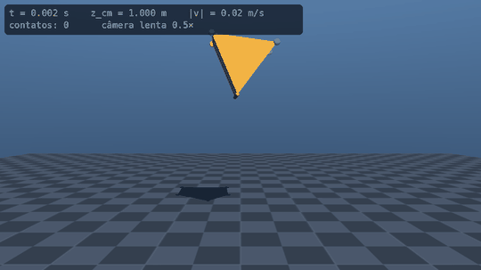
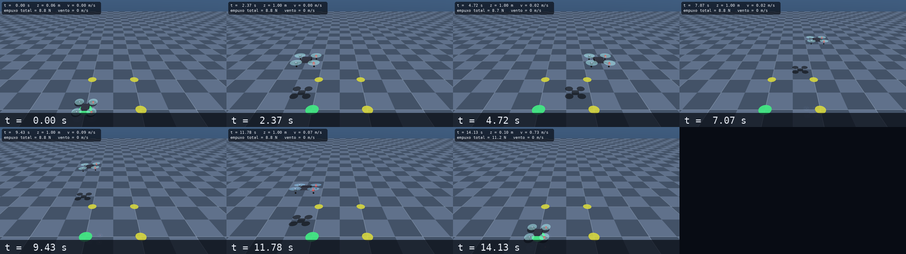
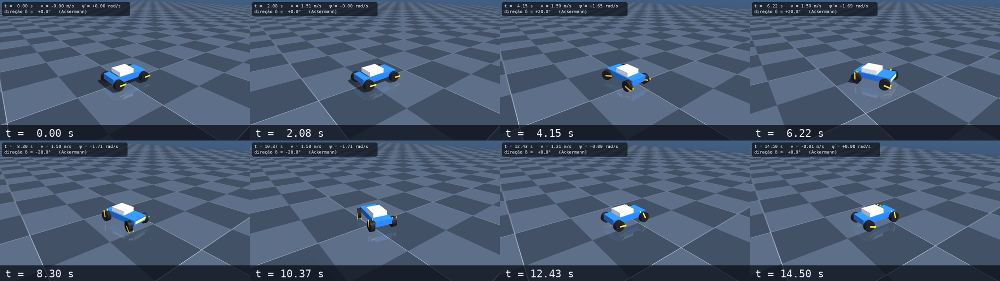
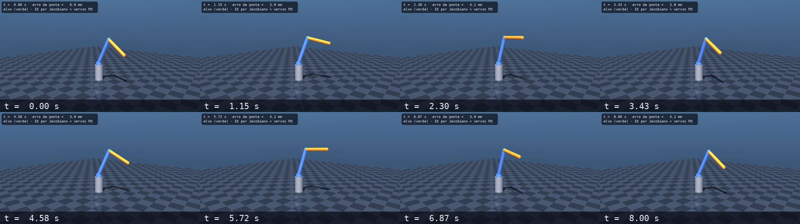
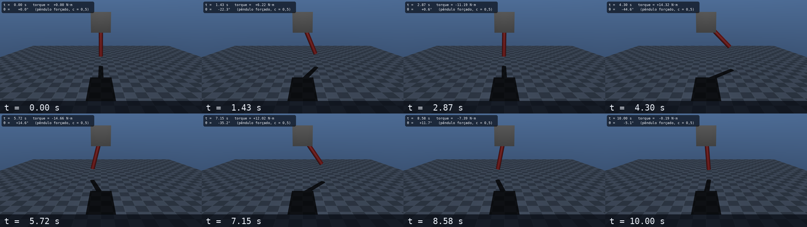

<div align="center">

# MuJoCo Lab

**Laboratório de simulação física com o MuJoCo 3.15: experimentos validados contra a física analítica, robôs, drones e veículos — e uma agent skill que dá a qualquer agente de IA controle total da ferramenta, com a documentação oficial offline.**




*Demo: um prisma triangular de cabeça para baixo cai, quica, tomba e repousa. O `run.py` confere massa, instante do impacto, energia e altura de repouso contra fórmulas fechadas.*

</div>

> **TL;DR (English):** a MuJoCo 3.15 lab where every experiment is checked against analytic physics and exits `0/1`; a ready-to-load **agent skill** (16 verified references, tested templates for an arm, a quadrotor and a car, offline docs search); an audited deep-research dossier (337 searches, 99 claims of a technical report checked, 38 independent re-executions); and measured MJX / MuJoCo Warp numbers on an RTX 4070 laptop. Docs are in Portuguese; code and identifiers in English.

## Por que isso existe

Modelos de IA (e muita gente) aprenderam MuJoCo na versão 3.3 ou antes — e ele muda a cada poucas semanas: `mjData.qM` foi removido, atuadores multi-entrada quebram o acesso por nome, o `margin/gap` mudou de semântica, o integrador recomendado não é o padrão. Este projeto troca "achismo" por **conhecimento verificado**: cada afirmação virou um teste executado ou uma citação literal, e tudo foi empacotado numa skill que um agente pode carregar antes de mexer na ferramenta.

## O que tem aqui

- **Experimentos que se auto-validam** — cada `run.py` compara ≥ 3 grandezas com a física analítica e sai com código `0/1`; geram vídeo, GIF, tira de quadros e gráficos.
- **[`mujoco-agent-skill`](.agents/mujoco-agent-skill/SKILL.md)** — protocolo de trabalho, 16 referências (instalação, MJCF, API Python, física/contato, atuadores e sensores, robôs, drones, veículos, GPU, Rerun, render…), 9 scripts, 5 templates testados e uma suíte `pytest`.
- **Documentação oficial offline** — espelho da tag 3.15.0 (MuJoCo, MuJoCo Warp, Playground, MJPC, Menagerie) + busca por texto, atributo MJCF, elemento, função C, enum e changelog ([`docs_search.py`](.agents/mujoco-agent-skill/scripts/docs_search.py)).
- **Pesquisa profunda auditada** — [dossiê](pesquisas/2026-10-07-qual-e-a-forma-correta-e-atual-mujoco-3-15-x-out-2026-de-ins.md) com 16 perguntas, 362 fontes citadas e [verificação independente](pesquisas/verificacao/independente.md) por reexecução.
- **Benchmarks de GPU reais** — MJX e MuJoCo Warp medidos numa RTX 4070 Laptop de 8 GB ([resultados](.agents/mujoco-agent-skill/references/gpu-benchmarks.md)).

## Começar

Requisitos: Linux (testado em CachyOS/Arch, KDE Wayland), [`uv`](https://docs.astral.sh/uv/) e Python 3.13. GPU NVIDIA só é necessária para MJX/Warp.

```bash
git clone https://github.com/frederico-kluser/mujoco-lab && cd mujoco-lab
uv sync                                                        # .venv com mujoco 3.15, numpy, scipy, matplotlib, imageio
uv run python experiments/01_triangulo_invertido/run.py        # demo + validação física → experiments/01_…/out/ (mp4, gif, gráficos)
uv run python experiments/01_triangulo_invertido/view.py       # a mesma cena numa janela interativa
uv run pytest .agents/mujoco-agent-skill/tests -q              # 23 testes (scripts, templates, experimentos, armadilhas; 1 só roda após o sync_docs.py abaixo)
python3 .agents/mujoco-agent-skill/scripts/sync_docs.py        # (opcional) espelha a documentação oficial em docs/upstream/ (~17 s)
python3 .agents/mujoco-agent-skill/scripts/env_check.py        # diagnóstico: Python, MuJoCo, GL/EGL, GPU, docs
```

Sem janela (CI/agentes) o render usa `MUJOCO_GL=egl`. Novos experimentos: `python3 .agents/mujoco-agent-skill/scripts/new_experiment.py <nome> --template blank|pendulum|arm|quadrotor|car`.

## Experimentos

| # | Experimento | O que valida | Resultado medido (MuJoCo 3.15.0) |
| --- | --- | --- | --- |
| [01](experiments/01_triangulo_invertido/README.md) | Triângulo de cabeça para baixo caindo | massa = ρ·V, impacto = queda livre, energia, repouso, altura = raio inscrito | 20,7846 kg (= analítico) · impacto em 0,398 s (previsto 0,396 s) · repouso a 0,1155 m (= raio inscrito) |
| [02](experiments/02_pendulo/README.md) | Pêndulo físico | período exato (integral elíptica) × Euler/RK4/implicit/implicitfast | erro de período ≤ 0,0002 % · RK4 conserva a energia; os demais derivam +0,0024 % em 10 períodos |
| [03](experiments/03_haste_relatorio/README.md) | Haste articulada de um relatório técnico | o modelo original trava por colisão; correção; pêndulo forçado × EDO | \|θ\|máx 0,005 → 2,24 rad · RMS de 0,54 mrad contra a EDO não linear |
| [04](experiments/04_drone_quadricoptero/README.md) | Quadricóptero | controlador geométrico SO(3), waypoints, vento | decola em 1,08 s · erro ≤ 0,3 cm nos waypoints (≤ 4 cm com vento de 8 m/s) |
| [05](experiments/05_carro_ackermann/README.md) | Carro de 4 rodas | direção Ackermann × modelo cinemático de bicicleta | guinada 6,3 % abaixo da previsão (μ = 1); derrapa com μ = 0,35 |
| [06](experiments/06_braco_3gdl/README.md) | Braço robótico 3 GDL | cinemática inversa por Jacobiano + servos PD | erro RMS de 4 mm · torque máximo de 1,6 N·m |

<table>
  <tr>
    <td align="center"><br><sub>04 · quadricóptero</sub></td>
    <td align="center"><br><sub>05 · carro Ackermann</sub></td>
  </tr>
  <tr>
    <td align="center"><br><sub>06 · braço 3 GDL</sub></td>
    <td align="center"><br><sub>03 · pêndulo forçado</sub></td>
  </tr>
</table>

## A agent skill

Peça ao agente para carregar `mujoco-agent-skill` antes de qualquer trabalho com MuJoCo (ela é descoberta por `.agents/skills/` e `.claude/skills/`, symlinks já versionados). Ela impõe um protocolo: **consultar a documentação local antes de afirmar → partir de um template testado → validar o modelo → simular sem janela com critérios de aceitação → depurar → registrar**.

| Referência | Para quê |
| --- | --- |
| [`mjcf-cheatsheet`](.agents/mujoco-agent-skill/references/mjcf-cheatsheet.md) · [`python-api`](.agents/mujoco-agent-skill/references/python-api.md) | modelar e programar (o que mudou de 3.0 a 3.15) |
| [`physics-tuning`](.agents/mujoco-agent-skill/references/physics-tuning.md) · [`actuators-sensors`](.agents/mujoco-agent-skill/references/actuators-sensors.md) | integradores, contato, estabilidade; atuadores e sensores |
| [`robots`](.agents/mujoco-agent-skill/references/robots.md) · [`drones`](.agents/mujoco-agent-skill/references/drones.md) · [`vehicles`](.agents/mujoco-agent-skill/references/vehicles.md) | braços e URDF, quadricópteros e aerodinâmica, rodas e pneus |
| [`gpu-mjx-warp`](.agents/mujoco-agent-skill/references/gpu-mjx-warp.md) · [`gpu-benchmarks`](.agents/mujoco-agent-skill/references/gpu-benchmarks.md) | MJX e MuJoCo Warp: limites, receita e medições |
| [`rendering-viewer`](.agents/mujoco-agent-skill/references/rendering-viewer.md) · [`telemetry-rerun`](.agents/mujoco-agent-skill/references/telemetry-rerun.md) · [`install-linux`](.agents/mujoco-agent-skill/references/install-linux.md) | render/viewer em Wayland+NVIDIA, Rerun, instalação |
| [`docs-map`](.agents/mujoco-agent-skill/references/docs-map.md) · [`official-skills-errata`](.agents/mujoco-agent-skill/references/official-skills-errata.md) | mapa da doc e quebras por versão; 63 blocos das skills oficiais executados (12 falham) |
| [`experiments-playbook`](.agents/mujoco-agent-skill/references/experiments-playbook.md) · [`relatorio-auditoria`](.agents/mujoco-agent-skill/references/relatorio-auditoria.md) | método de validação e catálogo de experimentos; auditoria de um relatório técnico |

## Pesquisa e verificação

A pesquisa usou o modo profundo da [`tavily-agent-skill`](https://github.com/frederico-kluser/tavily-agent-skill): **16 investigadores em paralelo, 337 consultas, 585 fontes lidas, 400 afirmações com citação literal**, um crítico de contexto limpo e uma etapa de **reexecução independente** (38 checagens contra o MuJoCo instalado, AUR, PyPI e GitHub — 38/38 confirmadas). Um relatório técnico de partida foi auditado afirmação por afirmação (99): 31 corretas, 47 parciais, 10 incorretas, 2 desatualizadas, 3 não verificadas, 6 fora do escopo. Destaques:

- `pkg_search_module(MUJOCO mujoco)` não funciona (o MuJoCo não instala `mujoco.pc`); o caminho é `find_package(mujoco CONFIG)`.
- O RK4 **não** preserva «(h|ω|)²» e o integrador implícito **não** é incondicionalmente estável; o recomendado é o `implicitfast`.
- Os 2,96 M e 2,33 M de passos/s da documentação são ambos **MJX-Warp** (Humanoid e Aloha Pot), não "MJX contra MuJoCo Warp".
- Com atuadores multi-entrada (`pid`, `dcmotor`, `orientation`) o acessor `data.actuator('x').ctrl` grava no slot errado.
- `urdf2mjcf` não faz CoACD nem balanceia a inércia; e um exemplo de haste articulada travava a própria junta por colisão (experimento 03).

## GPU: MJX e MuJoCo Warp (RTX 4070 Laptop, 8 GB)

Humanoide, 4096 mundos, mediana de execuções (receita, protocolo e armadilhas em [`gpu-benchmarks.md`](.agents/mujoco-agent-skill/references/gpu-benchmarks.md)):

| Backend | Passos/s | VRAM |
| --- | ---: | ---: |
| MuJoCo Warp (nativo) | ≈ 1,9 M | 370 MiB |
| MJX-Warp | ≈ 1,8 M | 480 MiB |
| MJX-JAX | 27 K – 87 K | 1,2 GB |
| CPU, 32 threads (`mujoco.rollout`) | ≈ 0,25 M | — |

Os números oficiais (2,96 M / 3,35 M) não foram reproduzidos: a documentação não declara o hardware.

## Estrutura

```text
.
├── pyproject.toml · uv.lock          # ambiente (grupos opcionais: viz, urdf, rl, dmc, gpu)
├── models/                           # MJCF reutilizáveis
├── experiments/NN_nome/              # run.py (validação) · view.py · README.md · out/ (gerado, ignorado)
├── lab/mjkit.py                      # symlink para a biblioteca da skill (Ctrl, record, plot…)
├── .agents/mujoco-agent-skill/       # SKILL.md · references/ · scripts/ · assets/templates/ · tests/
├── pesquisas/                        # dossiê, fichas de conhecimento, retornos dos investigadores, verificação
├── docs/                             # relatório original, mídia do README, texto do LinkedIn, docs/upstream (gerado)
└── AGENTS.md                         # regras do projeto para agentes
```

## Notas e limites

- Verificado em MuJoCo **3.15.0** (2026-10-07); o estado de pacotes (AUR, PyPI) envelhece em dias — a skill indica como reverificar.
- A janela interativa do viewer só foi exercitada num teste de 3 s; o MuJoCo Studio (experimental) não roda em Wayland e não foi testado.
- MJX/MuJoCo Warp exigem um venv separado (`.venv-gpu`); o `uv sync --group gpu` não foi testado.
- A memória CoALA local do laboratório **não é versionada** (o motor vem de uma skill privada): veja [`.agents/mujoco-lab-agent-skill/README.md`](.agents/mujoco-lab-agent-skill/README.md). Sem ela nada quebra.
- Texto para divulgação: [`docs/linkedin-about.md`](docs/linkedin-about.md).

## Licença e créditos

Sem licença: todos os direitos reservados ao autor. O [MuJoCo](https://github.com/google-deepmind/mujoco) é da Google DeepMind (Apache-2.0) e a documentação oficial espelhada em `docs/upstream/` **não** é versionada aqui (é gerada por `sync_docs.py`).

Autor: [@frederico-kluser](https://github.com/frederico-kluser).
